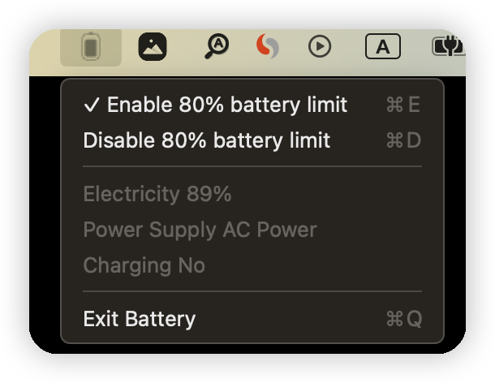

# Battery charge limiter for Apple Silicon Macbook devices

 The inspiration for this project comes from the [battery](https://github.com/actuallymentor/battery/tree/main) project. It uses its smc and corresponding scripts. The only difference is that I rewrote the interface with SwiftUI. The reason for rewriting is simple, because I failed to install its dmg.

⚠️ Mainland China users may be unable to directly install successfully due to mysterious forces and require corresponding scripts. It is recommended to first install the [command line version](https://github.com/actuallymentor/battery/blob/main/README.md#-command-line-version), then open the application:

### How do I support this project?

Do you have an awesome feature idea? [Add a feature request](https://github.com/LeetaoPrivateSpace/battery/issues/new/choose)

Just follow me on [Twitter](https://twitter.com/LeetaoGoooo)、Github and star this project.